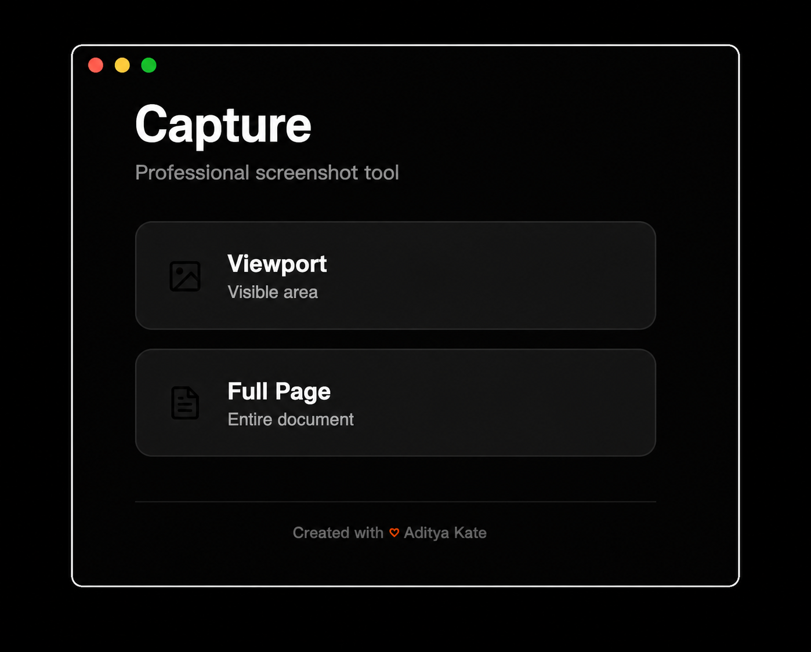

# Capture

A professional screenshot extension for Brave and Chromium browsers.


## Features

- **Viewport Capture** - High-quality screenshots of visible area
- **Full Page Capture** - Intelligent scrolling and stitching for entire pages
- **Preview System** - Review before saving or copying
- **One-Click Copy** - Direct clipboard integration
- **Professional UI** - Premium typography, custom animations, lucid icons
- **60fps Performance** - GPU-accelerated with custom easing curves

## Installation

1. Download or clone this repository
2. Open Brave browser and navigate to `brave://extensions/`
3. Enable **Developer mode** (top-right toggle)
4. Click **Load unpacked** and select the extension folder
5. Pin the extension to your toolbar (optional)

## Usage

Click the extension icon and choose your capture mode:

- **Viewport** - Captures what's currently visible on screen
- **Full Page** - Captures the entire scrollable webpage

Preview your screenshot, then **Copy** to clipboard or **Download** to save.

## Technical Stack

- **Format**: PNG with maximum quality (100%)
- **Typography**: Space Grotesk from Google Fonts
- **Animations**: Custom cubic-bezier easing (expo/quart)
- **Color System**: Warm neutrals with signature accent (#ff4d00)
- **Performance**: GPU-accelerated transforms, optimized rendering

## Design Principles

- Typography as architecture with dramatic scale contrast
- Custom easing curves (no default browser easing)
- Choreographed animations with intentional stagger
- Professional lucid icons (no emojis)
- 60fps performance target

## Browser Compatibility

- ✅ Brave Browser
- ✅ Google Chrome
- ✅ Microsoft Edge
- ✅ All Chromium-based browsers

## Screenshots



## Development

```bash
# Clone the repository
git clone https://github.com/adityajkate/capture-extension.git

# Load in browser
# Navigate to brave://extensions/
# Enable Developer mode
# Click "Load unpacked" and select the folder
```

## File Structure

```
capture-extension/
├── manifest.json          # Extension configuration
├── popup.html            # UI structure with lucid icons
├── popup.css             # Award-winning design system
├── popup.js              # Capture logic
├── icons/                # Extension icons (16, 32, 48, 128px)
└── README.md            # Documentation
```

## License

MIT License - Free to use and modify.

## Credits

Created with ♡ by [Aditya Kate](https://github.com/adityajkate)

---

**Note**: This extension cannot capture browser internal pages (brave://, chrome://) due to browser security restrictions.
